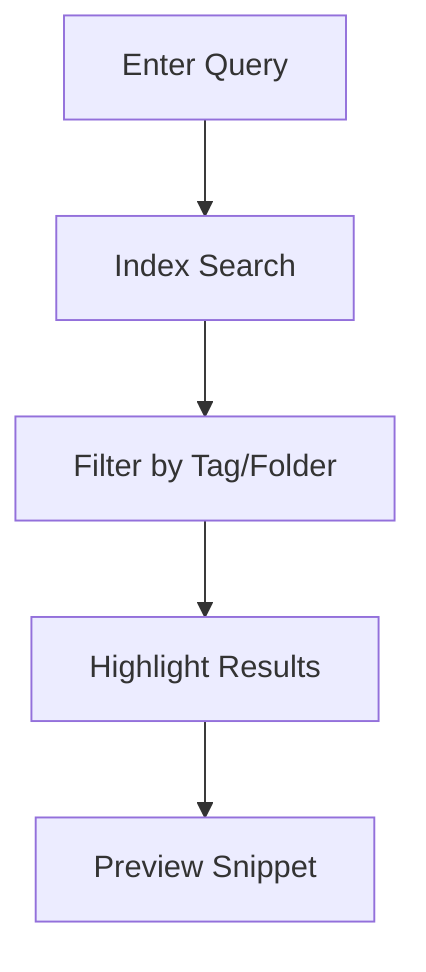

## Overview

Mani Balan provides a comprehensive set of tools to manage your project documentation effectively. You can organize documents hierarchically, collaborate with teams in real-time, track changes through version history, search across all content, and customize the interface to fit your workflow. These features make it ideal for technical teams, product managers, and developers maintaining living documentation.

<Columns cols={2}>
  <Card title="Organize Documents" icon="folder" href="#document-organization">
    Structure your docs with folders, tags, and nested pages for easy navigation.
  </Card>
  <Card title="Collaborate Seamlessly" icon="users" href="#collaboration">
    Edit together, leave comments, and assign tasks without leaving the platform.
  </Card>
  <Card title="Track Changes" icon="git-branch" href="#version-history">
    View diffs, revert commits, and maintain a complete audit trail.
  </Card>
  <Card title="Powerful Search" icon="search" href="#search">
    Find content instantly with full-text search and filters.
  </Card>
</Columns>

## Document Organization

Keep your documentation structured and accessible. Create folders, subfolders, and use tags to categorize content. Link pages together for a seamless knowledge base.

<Steps>
  <Step title="Create a Folder" icon="folder-plus">
    Navigate to the root directory and select "New Folder". Name it based on your project module, such as "API Reference".
  </Step>
  <Step title="Add Pages" icon="file-plus">
    Inside the folder, create new pages using Markdown or import from GitHub.
  </Step>
  <Step title="Tag and Link" icon="tag">
    Assign tags like `api`, `guide` and link related pages with `[Internal Link](/path/to/page)`.
  </Step>
</Steps>

<Callout kind="tip">
  Use hierarchical structures to mirror your project's architecture, making navigation intuitive.
</Callout>

## Collaboration and Editing

Work with your team in real-time. Multiple users can edit simultaneously, with live cursors and conflict resolution.

<Tabs>
  <Tab title="Real-time Editing" icon="edit-3">
    Changes appear instantly for all editors. Use `@mentions` to notify teammates.
  </Tab>
  <Tab title="Comments & Tasks" icon="message-circle">
    Highlight text, add comments, and convert them to actionable tasks.
  </Tab>
</Tabs>

```javascript
// Example: Embed collaborative snippet
const docId = 'project-docs-123';
const collabConfig = {
  realtime: true,
  permissions: ['read', 'write']
};
```

## Version History

Never lose work. Every change creates a commit with diffs, authors, and timestamps. Revert or branch as needed.

<Expandable title="View Change History" default-open="true">
  Right-click a page and select "History". Compare versions side-by-side:

  | Version | Author | Date       | Changes |
  |---------|--------|------------|---------|
  | v2.1   | Alice | 2024-10-15 | Added API endpoints |
  | v2.0   | Bob   | 2024-10-10 | Fixed typos |

  Restore any version with one click.
</Expandable>

## Search Functionality

Locate information quickly across your entire documentation space. Supports full-text, regex, and tag-based queries.



<Callout kind="info">
  Search indexes updates in under 1 second for collections up to 10,000 pages.
</Callout>

## Customization

Tailor Mani Balan to your needs. Adjust themes, sidebar layouts, and integrate custom CSS.

<CodeGroup tabs="Theme Config,Custom CSS">
```json
{
  "theme": "dark",
  "sidebar": {
    "collapsed": false,
    "autoHide": true
  }
}
```
````css
/* Add to custom styles */
:root {
  --primary-color: #3a2cc3;
}
.sidebar {
  background: var(--primary-color);
}
````
</CodeGroup>

<Board title="Customization Roadmap">
  <BoardColumn title="Planned" color="0" icon="calendar">
    <BoardCard title="Plugin System" description="Extend with custom components" dueDate="2024-12-01" />
  </BoardColumn>
  <BoardColumn title="In Progress" color="1" icon="loader-2">
    <BoardCard title="Advanced Themes" author="Design Team" />
  </BoardColumn>
  <BoardColumn title="Completed" color="2" icon="check-circle">
    <BoardCard title="Custom Domains" createdAt="2024-11-15" />
  </BoardColumn>
</Board>